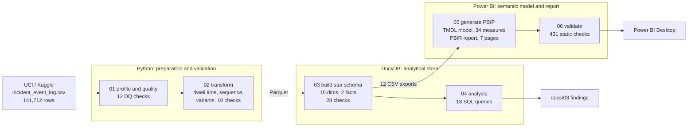
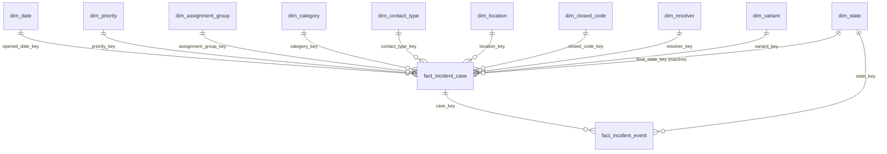

# BPM Process Intelligence & SLA Analytics Platform

End-to-end Business Intelligence solution over an enterprise **IT Incident Management**
event log (24,918 incidents and 141,707 process events, Feb 2016 – Feb 2017). It was
built to answer a question conventional ITSM reporting can't: *we know our SLA miss
rate, but we don't know what is causing it.*

The extract is treated as a **process-mining event log** (case, activity, timestamp,
resource) rather than a flat table. A Python pipeline derives the process structure, a
DuckDB star schema holds it, and a Power BI semantic model with 34 DAX measures reports
on it across seven pages.

---

## Headline findings

Every figure comes from [`sql/02_analysis_queries.sql`](sql/02_analysis_queries.sql).
Full evidence and caveats are in [Insights & recommendations](docs/05_insights_and_recommendations.md).

| # | Finding | Evidence |
|---|---|---|
| 1 | **SLA attainment is 63.4%, and it falls as priority rises.** Critical meets target 1.85% of the time; High 0.49%. | Moderate is 94% of volume *and* 91% of breaches, so the volume problem sits in the middle tier. |
| 2 | **Every handoff has a measurable cost.** | From 0 to 5+ reassignments, attainment falls from 78.4% to 14.3% and median resolution rises from 0.68 h to 292 h. 45.6% of incidents are reassigned at least once. |
| 3 | **Process conformance predicts outcome.** | The top 5 of 188 variants carry 82.9% of volume at 70.5% attainment and a 4.8 h median. The other 183 paths manage 29.2% and 181 h. |
| 4 | **A single wait step separates fast paths from slow ones.** | Every major path without `Awaiting User Info` attains 58–84%. Every path with it attains 24–35%. |
| 5 | **47% of elapsed time is post-resolution administration**, with incidents sitting in `Resolved` until a bulk close. | This is reported, not hidden. A bottleneck chart that drops its largest bar isn't an honest chart. |

**Stated limits:**
- 99% of volume falls in Mar–May 2016, so no trend claim is made after May 2016.
- The knowledge-article result is treated as selection bias, not causation.
- The data contains no cost information, so nothing is expressed in currency.

---

## Architecture



**Why two fact tables?** The process has two natural grains:
- Incident-level questions (SLA attainment, cycle time) live at **case grain**: 24,918 rows.
- Bottleneck questions (time in state) live at **event grain**: 141,707 rows.

Counting incidents at event grain would overstate volume by 5.7×. So each question is
answered at its own grain, against shared, conformed dimensions.



`dim_state` reaches the case fact by two paths: directly through `final_state_key`, and
indirectly through the event fact. Two active paths would make every state filter
ambiguous, so the direct one is **inactive**. No current measure needs it; it is kept so a
future "incidents by final state" measure can switch it on with `USERELATIONSHIP` without
a model change. For the same reason, the event fact's own date key is deliberately left
unrelated to `dim_date`.

---

## Stack and the reasoning behind it

| Layer | Tool | Why |
|---|---|---|
| Preparation | Python / pandas | Sequence logic (dwell time, ordering, variant signatures) is procedural. It's computed **once**, here, and never re-derived in SQL or DAX |
| Analytical store | DuckDB | Single-file, zero-install engine with full window functions. The DDL is ANSI SQL and ports to PostgreSQL unchanged |
| Model | Star schema | Conformed dimensions over a case-grain and an event-grain fact. An Unknown member at key 0 means no fact row is ever orphaned |
| Semantics & reporting | Power BI (PBIP / TMDL / PBIR) + DAX | Text-based project format, so the model and every visual can be diffed and reviewed in git |

**Deliberately excluded:** ML, cloud warehousing and streaming. The source is a static
46 MB historical extract. None of the three would change a decision any stakeholder
here is making.

---

## Engineering decisions worth noting

- **Every stage has validation gates:** 12 profiling checks, 10 transform checks, 28
  warehouse checks and 431 Power BI checks. Each stage fails loudly instead of passing
  bad data downstream.
- **The Power BI project is generated, then statically validated.** The validator proves
  that every DAX reference, visual field, relationship and CSV column resolves *before*
  the file is opened. Its first run caught 14 measures pointing at renamed columns. Each
  would have shown up as "Couldn't load the data for this visual" during a demo.
- **There's one rename map.** Warehouse-to-display names are defined once and applied to
  the model, the DAX and the report, so they can't drift apart.
- **Measures aggregate; they never iterate.** 0/1 integer flags make conditional counts a
  `SUM`. Every ratio uses `DIVIDE`. Cycle-time measures honour a single exclusion flag.
- **Concurrency:** one writer builds the warehouse and closes its connection in
  `finally`. Every consumer opens it read-only, so there is no path to a lock conflict.
- **Builds are idempotent.** Every stage can be re-run from scratch and produces the
  same output.

---

## Data quality: what profiling found

Full evidence is in [`data/quality/dq_report.md`](data/quality/dq_report.md).

1. **`closed_at` is a batch artefact (DQ-08).** Five timestamps on 24/3/2016 account for
   about 13,800 closures. That's a housekeeping job, not agents completing work, so cycle
   time uses `resolved_at` instead.
2. **`made_sla` is a live flag (DQ-09).** It changes mid-case for 36.6% of incidents, so
   the case fact takes the last observed value.
3. **Five columns are more than 98% empty (DQ-05).** They're excluded rather than shipped
   as near-empty attributes that invite false conclusions.
4. **Timestamps only have minute precision**, so `(case, timestamp)` isn't unique for 10%
   of rows (DQ-02). Events therefore carry a surrogate key and an explicit sequence number.
5. **5 events carry a `-100` sentinel state (DQ-06)** and are removed. That's why 141,712
   raw rows become 141,707 modelled events.
6. **1,556 incidents have no `resolved_at` (DQ-07).** They're excluded from cycle-time
   denominators, never counted as zero.

---

## Quickstart

```bash
pip install -r requirements.txt
python src/00_download_data.py
python src/01_profile_and_quality.py
python src/02_transform.py
python src/03_build_warehouse.py
python src/04_run_analysis.py
python src/05_generate_powerbi_project.py
python src/06_validate_powerbi_project.py
```

Then open `powerbi/ProcessIntelligence.pbip` from **inside** Power BI Desktop
(`File → Open report → Browse reports`, file type `*.pbip`). Windows has no default
association for `.pbip`, so double-clicking it may open an empty Desktop window.

Close Power BI Desktop before re-running step 05, because it holds locks on the report
folder.

---

## Report pages

| Page | Answers |
|---|---|
| 1. Executive Overview | Headline SLA, volume, cycle time and trend |
| 2. Workflow Bottlenecks | Where elapsed time accumulates, split into working and waiting |
| 3. SLA & Operations | Attainment by priority, group, category and channel |
| 4. Process Variants | Happy path vs long tail, and conformance |
| 5. Reassignment & Workload | Handoff cost, plus resolver and group concentration |
| 6. Time-Based Performance | Monthly, weekday and hour-of-day patterns |
| 7. Incident Drill-through | Event-by-event trace of a single incident |

Screenshots are in [`docs/images/`](docs/images/).

---

## Documentation

| Document | Contents |
|---|---|
| [01 Business requirements](docs/01_business_requirements.md) | Stakeholders, 19 business questions and scope |
| [DQ report](data/quality/dq_report.md) | Profiling and 12 data-quality checks |
| [03 Analysis findings](docs/03_analysis_findings.md) | Generated output of all 18 queries |
| [04 KPIs & DAX](docs/04_kpi_and_dax.md) | Generated catalogue of all 34 measures |
| [05 Insights & recommendations](docs/05_insights_and_recommendations.md) | Seven findings, six recommendations and stated limits |
| [06 Interview Q&A](docs/06_interview_qa.md) | The technical decisions, defended |
| [07 Presenting the project](docs/07_linkedin_and_cv.md) | LinkedIn post and CV entry |

---

## Repository layout

```
data/raw/        source event log (gitignored; reproduce via src/00)
data/processed/  parquet and warehouse exports (gitignored)
data/quality/    profiling and data-quality evidence (committed)
docs/            requirements, findings, KPI catalogue, insights
sql/             star-schema DDL and analytical queries
src/             Python pipeline, steps 00–06
powerbi/         PBIP project: TMDL semantic model + PBIR report
```

---

## Author

**Nidhish Nade** is a BPM Developer with about 4.3 years in workflow automation, BPMN,
Java/Spring Boot, SQL and APIs, now moving into Business Intelligence. This project applies
process knowledge from BPM engineering to a BI toolchain: the event log is read the way a
BPMN engine records a token moving through a process.
